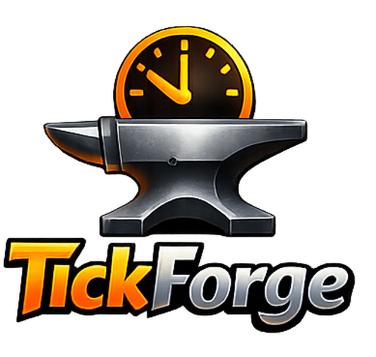

<p align="center">
  
</p>

<p align="center">
  A RuneLite-based development client for building, testing, and studying modular Old School RuneScape automation.
</p>

# Tickforge

Tickforge is an experimental RuneLite fork focused on **automation development tooling** and **reusable activity modules**.

The project keeps RuneLite's mature client and API surface underneath, while adding a Tickforge layer for experimenting with interaction execution, activity logic, recorded input data, script generation, and other automation-oriented developer tools.

It is intentionally a **development project rather than a plug-and-play bot client**. Using or extending it is expected to require understanding the codebase and building the pieces you need.

## Goals

Tickforge is being built around a few core ideas:

- **Reusable modules** — game activities should be implemented as small modules on top of shared framework services.
- **Centralised interaction execution** — gameplay interactions go through common infrastructure rather than every module inventing its own input path.
- **Developer tooling alongside automation** — recording, inspection, diagnostics, and script-generation tools are first-class parts of the project.
- **Human-derived input data** — recorded mouse and activity data can be used as source material for later movement and script-generation experiments.
- **Local-first data** — captured gameplay, mouse, activity, diagnostic, and generated datasets stay on the local machine and must not be committed to the repository.
- **Deliberate friction** — the repository is not intended to become a ready-to-run client for arbitrary users.

## Current Architecture

Tickforge currently lives inside the RuneLite client as a developer plugin and framework.

The main pieces are expected to evolve around:

- **Tickforge plugin / sidebar**
  - central entry point for Tickforge tooling
  - module discovery and management
  - developer-facing panels and controls

- **Activity modules**
  - self-contained implementations of individual activities
  - built against shared Tickforge services
  - kept separate from generic framework infrastructure

- **Interaction layer**
  - shared execution path for gameplay actions
  - keeps input behaviour consistent across modules
  - currently designed around emitting the required synthetic mouse event immediately before the associated client action

- **Recording tools**
  - mouse movement and click capture
  - activity-specific recordings
  - contextual event data useful for later analysis

- **Script generation**
  - a separate module that can consume recorded activity data
  - intended to generate or assist with activity-module implementations rather than being tightly coupled to the recorder

## Local Data Policy

Anything recorded or generated from live use should be treated as **local-only working data**.

This includes, for example:

- mouse movement recordings
- click and interaction traces
- activity recordings
- generated datasets
- runtime diagnostics containing gameplay state
- generated scripts that contain captured personal/session-specific data

Do **not** add these files to the repository.

Repository code should contain the tooling and schemas required to produce or consume this data, not the user's captured data itself.

## Running Tickforge

On Windows, the repository includes a helper script:

```powershell
./run-tickforge.ps1
```

The script builds the shaded RuneLite client JAR and launches the Tickforge development client with developer/debug options enabled.

You can also import the project into your IDE as a Gradle project and run the client directly while developing.

## Project Layout

Tickforge is built on RuneLite, so most of the upstream project structure remains intact.

Useful locations include:

- `runelite-api/` — RuneLite API interfaces and client-facing game data
- `runelite-client/` — the RuneLite desktop client and plugins
- `runelite-client/src/main/java/net/runelite/client/plugins/tickforge/` — Tickforge plugin, framework, UI, and modules
- `runelite-client/src/main/resources/net/runelite/client/plugins/tickforge/` — Tickforge plugin resources
- `docs/` — Tickforge design and development documentation

## Development Notes

When adding Tickforge features:

1. Prefer shared framework services for behaviour that multiple activity modules will need.
2. Keep activity-specific logic inside activity modules.
3. Keep recording and script generation as separate concerns.
4. Route gameplay interactions through the common interaction executor.
5. Keep captured/runtime data outside version control.
6. Preserve upstream RuneLite code where practical so future upstream comparison and maintenance remain manageable.

## Status

Tickforge is under active development and should be considered experimental.

The architecture, module APIs, recording formats, and interaction strategies may change as the project is tested and refined.

## RuneLite

Tickforge is derived from [RuneLite](https://github.com/runelite/runelite), the open-source Old School RuneScape client.

The upstream RuneLite project remains the foundation of the client, API, and much of the surrounding infrastructure. Tickforge-specific code and documentation are layered on top of that base.

## License

RuneLite is licensed under the BSD 2-Clause License. Existing upstream files retain their respective copyright and license notices.

See the repository's license files and individual source-file headers for the applicable terms.
